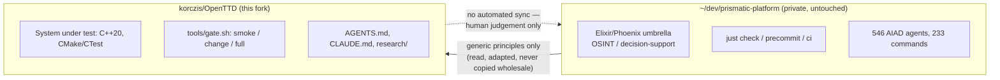
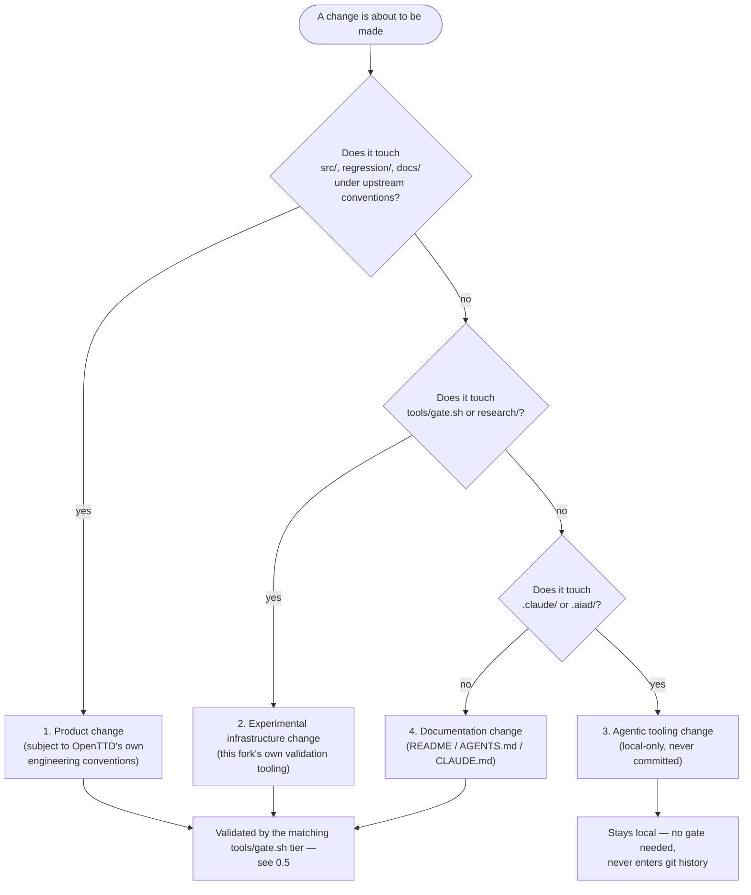
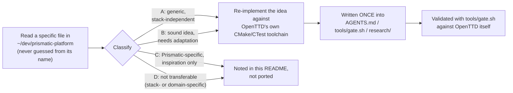
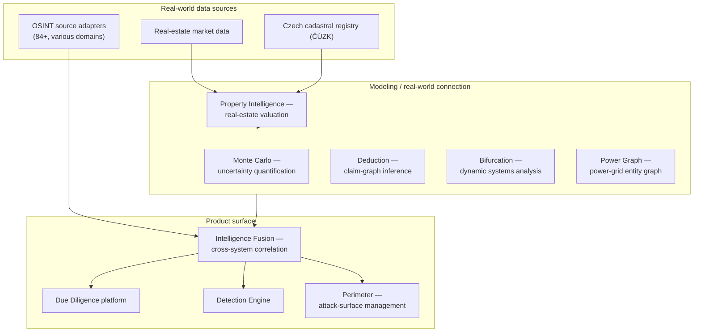
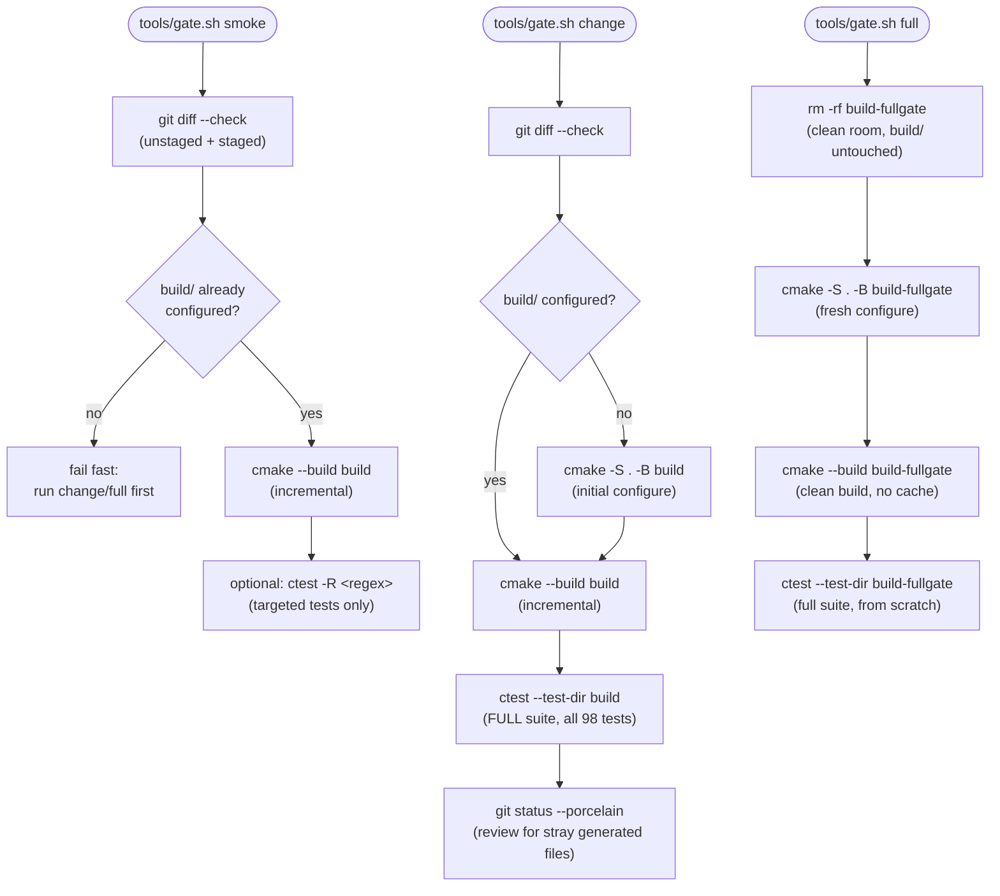
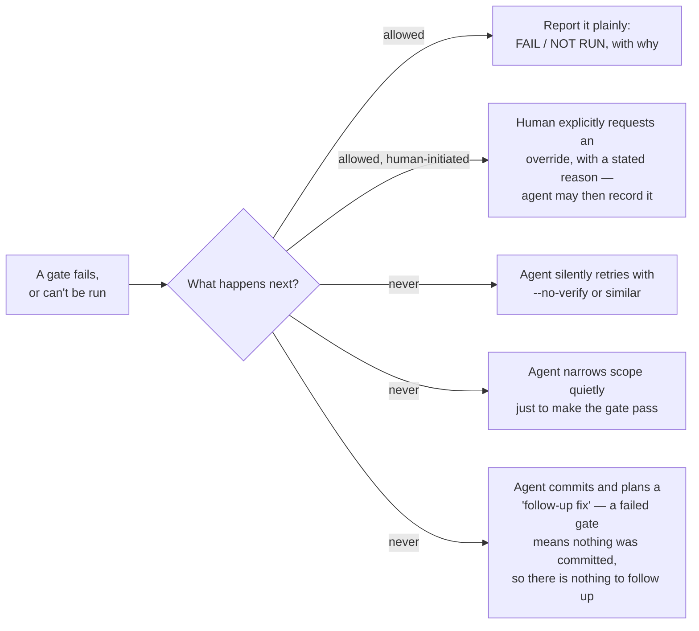

# OpenTTD

> **Private fork notice:** `korczis/OpenTTD` is not the official OpenTTD project and is not staged for upstream contribution. See [0.0) About this fork](#00-about-this-fork) below for what it actually is.

## Table of contents

- 0.0) [About this fork](#00-about-this-fork)
    - 0.1) [Purpose and goals](#01-purpose-and-goals)
    - 0.2) [Relationship to the Prismatic platform](#02-relationship-to-the-prismatic-platform)
    - 0.3) [What this fork is not](#03-what-this-fork-is-not)
    - 0.4) [What this fork adds on top of upstream OpenTTD](#04-what-this-fork-adds-on-top-of-upstream-openttd)
    - 0.5) [Validation / gating model](#05-validation--gating-model)
    - 0.6) [Ground rules (short version)](#06-ground-rules-short-version)
    - 0.7) [Relationship to upstream OpenTTD](#07-relationship-to-upstream-openttd)
    - 0.8) [Research questions](#08-research-questions)
    - 0.9) [Agent and cognition concepts under evaluation](#09-agent-and-cognition-concepts-under-evaluation)
    - 0.10) [Integration points](#010-integration-points)
    - 0.11) [Experiment lifecycle, outputs, and evidence policy](#011-experiment-lifecycle-outputs-and-evidence-policy)
    - 0.12) [Limitations](#012-limitations)
- 1.0) [About](#10-about)
    - 1.1) [Downloading OpenTTD](#11-downloading-openttd)
    - 1.2) [OpenTTD gameplay manual](#12-openttd-gameplay-manual)
    - 1.3) [Supported platforms](#13-supported-platforms)
    - 1.4) [Installing and running OpenTTD](#14-installing-and-running-openttd)
    - 1.5) [Add-on content / mods](#15-add-on-content--mods)
    - 1.6) [OpenTTD directories](#16-openttd-directories)
    - 1.7) [Compiling OpenTTD](#17-compiling-openttd)
- 2.0) [Contact and community](#20-contact-and-community)
    - 2.1) [Multiplayer games](#21-multiplayer-games)
    - 2.2) [Contributing to OpenTTD](#22-contributing-to-openttd)
    - 2.3) [Reporting bugs](#23-reporting-bugs)
    - 2.4) [Translating](#24-translating)
- 3.0) [Licensing](#30-licensing)
- 4.0) [Credits](#40-credits)

## 0.0) About this fork

`korczis/OpenTTD` is a **private research fork**, not the official OpenTTD project and not staged for upstream contribution. It is owned by korczis and used as a real, complex, long-lived C++ codebase to validate the **Prismatic platform** — a research effort evaluating coding-agent workflows: how agents plan and scope changes, how gating and reproducibility hold up in practice, and how agent-driven engineering behaves against a substrate too large and too convention-heavy to fake.

Sections 1.0 onward below are the **original upstream OpenTTD README**, kept intact for its technical value and attribution. This section only documents what's specific to this fork.

**At a glance:**

```
+-------------------------------+   studied, adapted    +--------------------------------+
|  ~/dev/prismatic-platform     |  ------------------->  |  korczis/OpenTTD (this fork)   |
|  (private, NEVER modified     |  generic principles    |  (private, this repository)    |
|   from this repository)       |  only — no code,       |                                 |
|                                |  no domain content     |  * C++20 game -- system under  |
|  * Elixir/Phoenix umbrella    |                         |    test (src/, regression/)    |
|  * OSINT / decision-support   |                         |  * tools/gate.sh --            |
|  * just check/precommit/ci    |                         |    smoke / change / full       |
|  * 546 AIAD agents, 233 cmds  |                         |  * AGENTS.md / CLAUDE.md /     |
|  * git-worktree session OS    |                         |    research/                   |
+-------------------------------+                         +--------------------------------+
              ^                                                          |
              |             no automated sync -- human judgement only    |
              +----------------------------------------------------------+
```



### 0.1) Purpose and goals

OpenTTD plays two roles at once in this repository:

- **System under test.** `src/`, `regression/`, the build system, and OpenTTD's own engineering conventions are the real substrate an agent has to actually respect to make a correct, working change — that's what makes it useful as a validation target instead of a toy. Concretely, this means things like: the deterministic command-pattern architecture (`src/command.cpp`) that every game-state mutation must go through, because multiplayer is bit-identical lockstep across clients; backward-compatible savegame versioning (`src/saveload/`) where a field, once shipped, can never simply be deleted; a YAPF pathfinder specialized per vehicle type; and a project-wide Doxygen documentation convention enforced by warning-heavy compiler flags. An agent that ignores any of these doesn't just write ugly code — it writes code that would desync a multiplayer game or corrupt old savegames, which is exactly the kind of "looks fine, is actually broken" failure this fork exists to catch before it's reported as a pass.
- **Not a product being developed here.** Nothing in this fork is intended to become an OpenTTD feature or fix, and no change here is judged by whether it improves gameplay. Changes exist to produce evidence about *how the change was made and validated* — the deliverable of a session in this repository is closer to an experiment report (see `research/experiment-template.md`) than to a shipped feature.

Concretely, this fork exists to:

- **validate and stress-test the Prismatic platform** against a real, non-trivial, long-lived codebase, rather than a purpose-built toy. A toy codebase can be shaped to be easy for an agent to succeed in; OpenTTD wasn't built for that and doesn't bend to make results look better than they are.
- **run controlled experiments with coding agents** — planning, scoping, and executing changes under explicit constraints (see the four kinds of change below), so that a given experiment has a stated goal, a bounded surface area, and a predictable way to tell whether it succeeded.
- **evaluate the quality of changes, fixes, and refactors, and the decision processes behind them** — not just whether a diff compiles, but whether the reasoning that produced it holds up: did the agent correctly identify the relevant convention (e.g. "this touches game state, so it must go through a command handler"), or did it get a working-looking result for the wrong reason.
- **measure the reproducibility, quality, and reliability of agentic workflows** — can the same task, run again (possibly by a different agent, or the same agent on a different day), be trusted to produce a comparable, honestly-reported result, rather than a one-off lucky success.
- **develop and validate gating, tooling orchestration, and experimental protocols** — the layered `tools/gate.sh` model and the `research/` reporting taxonomy in this repository are themselves part of what's being evaluated, not just scaffolding around it: a gating design that's too cheap to catch real problems, or too expensive to actually get used, is itself a negative result worth knowing about.

Every change made in this fork should be traceable to at least one of the five goals above — if it isn't, it's probably out of scope for this repository (see 0.3).

Why this matters beyond the mechanics: Prismatic's actual application domain (see 0.2.1) is decision-support work where a wrong or overconfident answer has real cost. That's part of why this fork insists on the fail-closed reporting habit described in 0.6 — never claiming PASS on untested work — rather than on optimistic status reporting: the gating discipline being validated here is meant to transfer back to a context where it actually matters, not just to look tidy in a research repo.

**The four kinds of change** (from `AGENTS.md`) that every experiment in this fork is classified as, before it's touched:



### 0.2) Relationship to the Prismatic platform

#### 0.2.1) What Prismatic is

**Prismatic** is a separate, private platform under active development by korczis — its own repository, `~/dev/prismatic-platform`, is not part of this repository and is never modified by work done here. Studied directly from that repository (its own `mix.exs` and `CLAUDE.md`) rather than guessed:

- It's an Elixir/Phoenix **umbrella monorepo** — dozens of independent applications under `apps/` (OSINT source connectors, storage backends across several engines, browser automation/crawling, an internal agent-orchestration kernel, a web front end, and more), built around **interactive decision-support and OSINT (open-source intelligence) work** — the platform's own stated focus is due-diligence investigation, critical-infrastructure threat analysis, and M&A-style research.
- It carries a correspondingly large investment in its **own AI-agent engineering tooling**: several hundred specialized agent definitions and domain-specific commands under its own `.claude/`/`.aiad/`, a layered `just check` / `just precommit` / `just ci` local-validation workflow (the direct ancestor of this fork's `tools/gate.sh` smoke/change/full tiers), and a git-worktree-based session-isolation system so multiple agent sessions can work without stepping on each other.
- Its process documentation is dense, self-referential, and specific to its own stack and internal conventions — useful as raw material to mine for generic principles, not something to import wholesale (see 0.2.3).

#### 0.2.2) Why an unrelated, external codebase is used to validate it

A platform whose actual job is decision-support/OSINT analysis can't cleanly validate its own agentic tooling against its own codebase — an agent that's good at editing code that's already full of hooks and conventions *for* the very tooling being tested doesn't tell you much about how well that tooling generalizes. OpenTTD was picked deliberately because it shares essentially nothing with Prismatic:

- it's a 20+ year old, large, real C++20 codebase (500+ subdirectories under `src/` alone) with its own strict, unrelated engineering conventions — a deterministic command-pattern architecture, backward-compatible savegame versioning going back decades, a heavy Doxygen documentation style;
- it has nothing to do with Elixir, Phoenix, OSINT, or decision-support workflows, so no part of it was shaped to be agent-friendly or Prismatic-friendly;
- it has an established, independently working build and test toolchain (CMake + CTest, 98 pre-existing tests) that this fork's own gating model can be checked against without having to trust the very tooling under evaluation to grade itself.

That independence is the point: results produced in this fork say something about how Prismatic's agentic workflows and gating designs hold up against unfamiliar, real-world engineering conventions, rather than against code that was already shaped to fit the platform.

#### 0.2.3) What is adapted vs. left behind

This fork's relationship to Prismatic is one-directional and deliberately arm's-length:

- **Principles flow from Prismatic into this fork, adapted — not copied wholesale.** Where Prismatic's own workflow conventions contain a generic, stack-independent idea (for example: a cheap/standard/expensive tiered validation model with one entry point per tier, or a fail-closed reporting taxonomy that refuses to round an uncertain result up to "passed"), this fork re-implements that *idea* against OpenTTD's own CMake/CTest toolchain in `AGENTS.md`, `tools/gate.sh`, and `research/`. Prismatic-specific implementation detail (its language/framework, its own tool and app names, its internal branding, doctrine, and domain-specific policies) is deliberately left behind — see `AGENTS.md` for the explicit classification of what was and wasn't carried over, and why.
- **Nothing flows back automatically.** Findings from working in this fork inform Prismatic's own design by human judgment, not by any automated sync — there is no tooling in either repository that writes from one into the other. `~/dev/prismatic-platform` is read for inspiration; it is never edited from here.

#### 0.2.4) Integration mechanics — what actually gets read, and how

"Adapted, not copied" isn't a vague policy statement — every principle that made it into this fork followed the same concrete pipeline:



Concrete examples of what actually crossed that pipeline while this fork's tooling was built — not hypothetical, this is what happened:

| Studied in Prismatic | Category | Landed as, in this fork |
|---|---|---|
| `justfile`'s `check` / `precommit` / `ci` tiers (~30s / ~2-3min / ~5-10min, one entry point per tier, "these match what CI runs too") | A — generic pattern | `tools/gate.sh smoke` / `change` / `full` |
| Fail-closed completion taxonomy (`VERIFIED` / `PARTIALLY VERIFIED` / `BLOCKED`; "don't mark VERIFIED unless every blocking criterion actually passed") | A — generic pattern | `research/README.md`'s PASS / FAIL / PARTIAL / NOT RUN / NOT APPLICABLE taxonomy |
| "No self-authorized gate bypass; an override may only be prepared at a human's own request, with their stated reason attached" | A — generic pattern | `AGENTS.md` ground rules |
| Mandatory report sections (mission, actions taken, files modified, next steps) enforced by a session-end hook before a report is accepted | A, simplified | `research/experiment-template.md`'s required fields |
| `mix compile` / `mix test` / `credo` / `dialyzer` as the actual per-tier check commands | B — needs adaptation | `cmake --build` / `ctest` (OpenTTD has no lint tool, so no lint step was invented to match) |
| Git Worktree Operating System (`just wt-new` / `wt-claim` / `wt-doctor`, mandatory per-session isolated worktrees so concurrent agents never share a dirty root) | C — inspiration only | Not built here; this fork instead follows the lighter-weight "check `git status`, protect the existing dirty tree" rule already in `AGENTS.md`, which addresses the same underlying concern for a solo fork with no concurrent sessions |
| A build-failing check that greps for and *forbids* rollback logic in database migrations | D — rejected, not transferable | Explicitly not echoed: OpenTTD's real rule points the opposite way — savegames must stay loadable forever (`src/saveload/`), so "forbid going backward" is the wrong instinct here |
| GitLab server-side pre-receive hook enforcing an `AIAD-Gate` commit trailer, with a multi-approver override protocol | D — not transferable | Not applicable — a solo private fork has no server-side git hooks and no second approver |

This wasn't a one-time import. If this fork's gating model changes in the future, new principles would be expected to cross the same pipeline — read the specific source, classify it, adapt (or reject) it explicitly, write it once.

#### 0.2.5) Selected Prismatic capabilities of particular interest

Within Prismatic's ~90 applications, the ones most relevant to *why* rigorous, honestly-reported agentic validation matters are the ones with the highest real-world stakes: OSINT collection, due-diligence synthesis, and quantitative modeling that's directly wired to real external systems. Read from each application's own README, not guessed from its name:

| Application | What it actually does |
|---|---|
| `prismatic_osint_core` | The core OSINT (open-source intelligence) framework — the foundation the other OSINT collectors build on. |
| `prismatic_osint_sources`, `prismatic_osint_business_financial`, `prismatic_osint_czech_legal`, `prismatic_osint_eu_institutions`, `prismatic_osint_network`, `prismatic_osint_social_media`, `prismatic_osint_czech_courts` | 84+ source adapters and domain-specific collectors — business/financial records, the Czech legal system, EU institutions, network infrastructure, social media, Czech courts. |
| `prismatic_dd` | The Due Diligence platform itself (production status). |
| `prismatic_intelligence_fusion` | Cross-system fusion hub: links OSINT, DD, Academy, and Storage into one workflow through a shared knowledge graph, with Bayesian confidence aggregation across independent sources — its own README is explicit that "isolated signals have limited value; fusion across domains multiplies intelligence value through correlation, contradiction detection, and confidence aggregation." |
| `prismatic_monte_carlo` | A probabilistic-simulation / uncertainty-quantification engine. |
| `prismatic_deduction` | A deterministic, purely functional logical inference engine over typed claim graphs (subject–predicate–object), with an R1–R4 rule engine for contradiction and missing-premise detection. |
| `prismatic_bifurcation` | Dynamic-systems analysis and bifurcation detection. |
| `prismatic_power_graph` | A versioned graph store modeling real Czech/EU power-grid entities (companies by IČO, individuals, EU institutions) and their relationships (ownership, board membership), hybrid in-memory (ETS) + KuzuDB persistence. |
| `prismatic_property_intelligence` | Czech real-estate intelligence with a direct integration into ČÚZK (the Czech cadastral authority) for property data, valuation, and ownership verification against the official registry. |
| `prismatic_re_sources` | Real-estate market data source connectors feeding the above. |
| `prismatic_perimeter` | External attack-surface management (EASM) — continuous discovery and risk-scoring of real internet-facing assets (domains, IPs, certificates, cloud resources). |
| `prismatic_detection_engine` | A multi-vector correlation engine unifying entity correlation, threat analysis, data-quality validation, ML pattern detection, and competitive intelligence behind one API. |
| `prismatic_visitor_intelligence` | High-throughput (10,000+ events/sec target) real-time visitor and company-identification intelligence. |



This is where "napojení na reálný svět" — connecting automated inference to actual external reality (a real cadastral registry, a real power grid, real OSINT sources, real due-diligence subjects) — is most concrete, and where a wrong or overconfident automated conclusion has the highest real cost. It's the strongest concrete case for the closing point of 0.1: the fail-closed reporting discipline validated in this OpenTTD fork is meant to transfer back to exactly this kind of high-stakes, real-world-grounded work — not to a context where an optimistic-but-wrong status report would be harmless.

**This is no longer just a design on paper.** [`research/prismatic-bridge/ARCHITECTURE.md`](./research/prismatic-bridge/ARCHITECTURE.md) documents an actual bridge — a standalone sibling repository, `~/dev/openttd-prismatic-bridge` (Python/FastAPI), that speaks OpenTTD's admin-network protocol directly, exposes a REST + WebSocket API, and can already start/steer a real, externally-controllable Company AI (`ai/PrismaticAI`) end to end (8/8 of its own tests passing). What's not built yet: the AI actually doing anything besides idling, a decision contract with `prismatic-platform`, and world seeding from real elevation data. Each remaining phase needs its own approval before being built — see the design doc for the full phase table and open questions (including an explicit, not-yet-resolved question about whether the bridge should move to Rust).

### 0.3) What this fork is not

- **Not affiliated with, and not a contribution channel to, the official [OpenTTD/OpenTTD](https://github.com/OpenTTD/OpenTTD) project** — despite being hosted on GitHub as `korczis/OpenTTD`, it has no operational relationship to the upstream repository: no shared issue tracker, no CI feeding results back upstream, no listing as an active fork in any contribution sense.
- **Not a place where issues or pull requests get opened upstream** — everything, including changes that happen to turn out well, stays local to this fork. A change proven here becoming an actual upstream contribution would require a separate, deliberate decision and a freshly-prepared PR built for that purpose specifically — that's out of scope for anything done in this repository by default.
- **Not bound, as a *local* rule, by upstream's own contribution process** (`CONTRIBUTING.md`, PR templates, the strict commit-message grammar, "ask before large changes" discussion norms, the "AI-generated contributions are against policy" clause, `commit-checker`/`docs-checker` CI). That whole process exists to let a large volunteer maintainer base safely accept changes from strangers into a shared project — it describes upstream's own governance model, not this one. This fork has a single owner and no external reviewers, so that model simply doesn't map onto it; it's kept in this fork's docs purely as background technical reference (e.g. it explains conventions visible in the code).
- **Not a public showcase of "an AI agent wrote OpenTTD code."** Results produced here are for informing Prismatic's own design, not for demonstrating agentic coding to an audience — hence the emphasis on honest, fail-closed reporting over polished-looking output.

### 0.4) What this fork adds on top of upstream OpenTTD

| Path | Purpose |
|---|---|
| [`AGENTS.md`](./AGENTS.md) | Vendor-neutral ground rules for any coding agent working here: the four kinds of change, no-upstream / no-auto-commit / protect-dirty-tree rules, fail-closed reporting, the validation-layer model. |
| [`CLAUDE.md`](./CLAUDE.md) | Claude Code-specific workflow notes (points to `AGENTS.md` first), plus OpenTTD's own build/run/test commands, architecture, and code style as technical reference. |
| [`tools/gate.sh`](./tools/gate.sh) | Single entry point for layered local validation — see 0.5 below. |
| [`research/`](./research/) | The validation-layer writeup and a PASS/FAIL/PARTIAL/NOT RUN/NOT APPLICABLE experiment-report template. |
| `.claude/`, `.aiad/` *(not committed)* | Personal Claude Code tooling imported from a sibling private project, kept strictly local via `.git/info/exclude`. |

Laid out as a tree, to make the upstream/fork boundary explicit:

```
korczis/OpenTTD/
├── src/, regression/, docs/, cmake/, os/, media/, bin/     <- upstream OpenTTD, conventions unmodified
├── CMakeLists.txt, COMPILING.md, CODINGSTYLE.md, ...       <- upstream build system & docs, unmodified
├── CONTRIBUTING.md, .github/                               <- upstream contribution process (background reference only, see 0.3)
├── COPYING.md, CREDITS.md                                  <- upstream license & attribution, unmodified (see 0.7)
│
├── README.md            <- upstream content preserved below "0.0) About this fork" (this document)
├── AGENTS.md             * fork-added: vendor-neutral agent ground rules
├── CLAUDE.md              * fork-added pointer + preserved upstream-technical reference content
│
├── tools/
│   └── gate.sh            * fork-added: smoke / change / full validation entry point
│
├── research/
│   ├── README.md          * fork-added: gating model + PASS/FAIL/PARTIAL/NOT RUN/NOT APPLICABLE taxonomy
│   └── experiment-template.md  * fork-added: experiment report template
│
├── .claude/                 (fork-added, LOCAL ONLY — .git/info/exclude, never committed, never pushed)
└── .aiad/                   (fork-added, LOCAL ONLY — .git/info/exclude, never committed, never pushed)
```

### 0.5) Validation / gating model

Local validation is layered by cost, with one entry point (`tools/gate.sh`) for the build/test tiers:

| Tier | Command | Cost | When to use it |
|---|---|---|---|
| Smoke | `tools/gate.sh smoke` | cheapest | fast feedback while actively iterating |
| Change | `tools/gate.sh change` | standard | before calling a task/change done |
| Full | `tools/gate.sh full` | expensive | significant changes, or an experimental baseline |
| Research/evaluation | [`research/experiment-template.md`](./research/experiment-template.md) | n/a | records what was actually done and validated for an experiment |

All three build/test tiers are thin wrappers around OpenTTD's own existing CMake/CTest toolchain (see `CLAUDE.md` §Test) — there is no separate lint/format gate, because no such tool currently exists in this codebase, and this fork doesn't fake one. Full details and the experiment-report taxonomy are in [`research/README.md`](./research/README.md).

What each tier actually runs, and why the cost differs:



This is measured, not estimated: the last real run of `tools/gate.sh change` against this repository built cleanly and passed **98/98 tests in 7.40 seconds** (see the change history of this file and `tools/gate.sh` for when). `full` deliberately builds into `build-fullgate/` rather than wiping the existing `build/` — that keeps a fast iteration build available even while a clean-room validation run is being prepared or reviewed.

### 0.6) Ground rules (short version)

The full rules live in [`AGENTS.md`](./AGENTS.md); in short:

- **No pushes, issues, or PRs to upstream OpenTTD, ever.** This fork's git history and this fork's GitHub repository are the only places any of this work is visible.
- **No commit or push without an explicit, current instruction** — prior approval doesn't carry forward to later, different changes. Every commit in this repository's history was made in direct response to an explicit instruction in the session that produced it, not inferred from "you approved something like this before."
- **Protect the existing working tree** — check `git status` before anything destructive (`checkout`/`restore`/`reset`/`clean`, `rm -rf` inside the repo), and never discard uncommitted work that wasn't created in the current session.
- **Prefer minimal, scoped changes over broad refactors** — this is a research substrate, not a product to polish; a large unscoped diff is harder to attribute to a specific experiment goal (see 0.1).
- **Report validation honestly** — never claim a gate passed if it wasn't run, and never round an ambiguous result up to PASS. Concretely, this is why 0.5 above states plainly which tier was actually last measured, rather than implying all three run on every change.

The anti-bypass rule specifically, since it's the one most tempting to shortcut under time pressure:



### 0.7) Relationship to upstream OpenTTD

This fork tracks upstream OpenTTD as its technical foundation and does not modify its license, copyright, or attribution — see [3.0) Licensing](#30-licensing) and [4.0) Credits](#40-credits) below, both unchanged from upstream. Everything from section 1.0 onward is the original upstream README.

This is a checkable claim, not just an assertion — from the repository root:

```bash
git log --oneline -- COPYING.md CREDITS.md   # only upstream commits should appear
git diff upstream/master -- COPYING.md CREDITS.md  # (if an upstream remote is configured) empty diff expected
```

Everything this fork adds lives in the paths listed in the tree in 0.4 above, plus the "0.0) About this fork" section of this very file — the upstream game, its build system, its license, and its credits are otherwise carried forward unmodified.

### 0.8) Research questions

These are open questions this fork is used to investigate, not conclusions — none of them should be read as already answered:

- Can an agent correctly classify a requested change into the right one of the four kinds of change (0.1, `AGENTS.md`) before touching anything, and scope it accordingly?
- Does a tiered, cost-matched validation model (smoke/change/full, 0.5) actually get used proportionately to change size in practice, or does it get over- or under-applied under time pressure?
- Does fail-closed status reporting (never rounding PARTIAL up to PASS, 0.6) hold up consistently across many sessions, or does drift toward optimistic reporting appear over time?
- How well does a change made in a large, convention-heavy, deterministic-lockstep codebase (OpenTTD) hold up against the specific invariants that actually break it — e.g. mutating game state outside `src/command.cpp`, or a savegame-incompatible field change — rather than merely compiling and passing existing tests?
- When the admin-network bridge described in [`research/prismatic-bridge/ARCHITECTURE.md`](./research/prismatic-bridge/ARCHITECTURE.md) is used to let an external process control a Company AI, can success or failure of an issued directive be reported using the same PASS/FAIL/PARTIAL/NOT RUN/NOT APPLICABLE taxonomy already used for build/test gates?
- If repository-level retrieval or shared agent coordination state (0.9) is ever wired into sessions working in this fork, does it measurably change scoping accuracy or gate outcomes compared to sessions without it?

### 0.9) Agent and cognition concepts under evaluation

This section separates what's actually confirmed from what isn't. Sources: this README's own 0.2 (studied directly from `~/dev/prismatic-platform` in an earlier session), and, where noted, this fork's local, git-excluded `.aiad/`/`.claude/` directories — personal Claude Code tooling imported from Prismatic for local reference (`AGENTS.md`). Neither source was re-verified live against `~/dev/prismatic-platform` while this section was written (0.12).

#### AIG

Not defined in any source available to this session. This document does not expand or guess at the term; it's intentionally left out of this glossary rather than defined speculatively. A future revision should only define it after reading an explicit definition in Prismatic's own documentation.

#### RAG (retrieval-augmented context)

Prismatic's own imported agent tooling repeatedly describes retrieval-augmented generation as a real mechanism elsewhere in that platform — embedding-based retrieval over indexed content, with named quality dimensions such as retrieval precision and context-relevance scoring. **None of this is currently wired into how agents work in this OpenTTD fork**: a session here reads repository files directly with ordinary tools, not through an indexed retrieval layer. RAG is listed as a **conceptual** integration point (0.10) — something this fork could plausibly be used to evaluate if a retrieval layer were ever pointed at it — not a mechanism in current use. If it is used here in the future, a retrieved passage's relevance score would not by itself be evidence that the retrieved content is correct or applicable (0.11).

#### Blackboard-style coordination

The same local tooling repeatedly references a shared, topic-namespaced put/subscribe coordination store used to share state, hypotheses, and evidence across multiple specialized agents elsewhere in Prismatic. As with RAG, **this is not currently used by sessions working in this fork** — there is no shared coordination state between agent sessions here beyond the git history and this documentation. It's listed as a **conceptual** integration point: relevant open questions include whether shared state reduces duplicated work and improves handoffs between sessions, or whether it just as easily propagates an incorrect assumption from one session to the next. The existence of shared state is not itself evidence of better coordination.

#### Prismatic agents / roles

The imported local tooling defines a very large number of specialized, individually named agents, but not a small, generic role taxonomy (e.g. "planner / implementer / reviewer / verifier") that this document can responsibly claim maps onto sessions in this fork. No such mapping is asserted here. This fork's own experiment workflow (0.11) instead uses its own generic steps — plan, implement, validate, report — carried out by whichever coding agent is working a given session, under human oversight; these are not claimed to correspond to specific named Prismatic agent roles.

### 0.10) Integration points

| Integration point | Role | Data / artifacts | Status |
|---|---|---|---|
| Repository access | A coding agent reads and edits this fork's working tree under `AGENTS.md` ground rules | Git history, diffs, working-tree state | Implemented |
| Task specification | A session's stated goal, classified into one of the four kinds of change (0.1) | Task prompt, base revision | Implemented |
| Build/test validation gates | `tools/gate.sh` smoke / change / full tiers wrapping this repo's own CMake/CTest toolchain | Exit codes, build/test output | Implemented (0.5) |
| Experiment reporting | `research/experiment-template.md` | A filled-in report; a working note, not committed or gated by default | Implemented (manual, not automated) |
| Admin-network control/observation bridge | Standalone `openttd-prismatic-bridge` service drives a Company AI via OpenTTD's admin network (`start_ai`/`reload_ai`) and exposes a REST/WebSocket observation API | HTTP/WebSocket traffic, admin-network TCP traffic | Implemented — Phase 1 only (see `research/prismatic-bridge/ARCHITECTURE.md` §5); lives in a separate, standalone repository, not this one |
| Prismatic decision-making wired to the bridge (`prismatic_monte_carlo` / `prismatic_deduction` / `prismatic_intelligence_fusion`) | Would compute the settings string the bridge sends to the in-game AI | A settings string via `/decision/pull` | Planned, not started (Phase 3/5 of the same document) |
| World seeding from real elevation/GIS data | Headless `-G <heightmap>` start | A heightmap file | Experimental / partially confirmed — the headless start path itself works; the data-prep pipeline (Phase 4) has not been built |
| Repository-level retrieval (RAG) feeding an agent's context in this fork | n/a | n/a | Conceptual (0.9) — referenced in Prismatic's own tooling, not confirmed as used in sessions here |
| Shared coordination state (Blackboard-style) across agent sessions in this fork | n/a | n/a | Conceptual (0.9) — same caveat |
| Human oversight / approval | Every commit, push, override, and large design change requires an explicit, current instruction (0.6) | This repository's own commit history; design docs such as `research/prismatic-bridge/ARCHITECTURE.md`, which is itself gated phase-by-phase on human approval | Implemented |

### 0.11) Experiment lifecycle, outputs, and evidence policy

A session working in this fork is expected to, in order:

1. State the task and which of the four kinds of change it is (0.1, `AGENTS.md`).
2. Record the base revision and working-tree state (`git status`, `git rev-parse --short HEAD`).
3. Make a scoped change.
4. Run the validation tier matching the change's size (0.5).
5. Capture the exact commands run and their exit status — not a summary like "tests passed."
6. Record what wasn't covered or remains uncertain.
7. Classify the result — `PASS` / `FAIL` / `PARTIAL` / `NOT RUN` / `NOT APPLICABLE` (`research/README.md`) — never rounded up.
8. Optionally record all of the above in a copy of [`research/experiment-template.md`](./research/experiment-template.md); it's a working note kept at the operator's discretion, not a committed or gated artifact by default.

Expected artifacts, when produced: the change itself (diff or commit, if any); the exact validation commands and their exit codes; a filled experiment report in the shape of `experiment-template.md`, if one is kept; and, for bridge-related work, the bridge's own test output and observation-endpoint state (`research/prismatic-bridge/ARCHITECTURE.md` §3) — which lives in a separate repository, not this one.

Claims and evidence discipline:

- A successful build shows the change compiles under the tested configuration — not that it's behaviorally correct.
- A passing test run supports only the behavior actually covered by the tests that ran.
- A generated diff or patch is an artifact, not a finding — the finding is the recorded validation outcome and its interpretation.
- An agent's own confidence or self-assessment is not independent validation.
- No result is `PASS` unless the validating command was actually run and actually succeeded (0.6, `research/README.md`).
- A retrieval score or a shared-coordination-state entry (0.9), if either is ever used here, is not by itself evidence that the retrieved content or shared assumption was correct.

### 0.12) Limitations

- Results produced in this fork are specific to the tasks, prompts, and repository revision they were produced against — not a general claim about agentic software engineering.
- OpenTTD is one large C++ codebase with its own particular conventions (0.1); it is not a representative sample of all software projects, languages, or domains.
- Agent behavior depends on the specific model, tools, and context available in a given session; results from one configuration don't automatically transfer to another.
- Passing this fork's existing tests demonstrates only the behavior those tests actually cover (0.11).
- This fork's own gating and reporting model (0.5, 0.6) is itself one of the things being evaluated here, not a proven-correct baseline — see 0.2.4's "D — rejected, not transferable" row for a concrete example of a Prismatic-side pattern this fork deliberately did not adopt.
- The admin-network bridge to a running OpenTTD server (`research/prismatic-bridge/ARCHITECTURE.md`) is, as of this document, a standalone service with an idling AI script and an undefined decision contract (its own Phase 2/3); findings about "an agent controlling a game" are currently limited to the control/observation transport working, not to any strategic decision quality.
- This revision of this section was written in a session with no live read access to `~/dev/prismatic-platform` (the active permission mode denied filesystem access outside this repository for most of the session). Its Prismatic-sourced claims rely on content already verified and written into this README in an earlier session that did have access (0.2), plus this fork's own locally cached, git-excluded agent tooling imported from Prismatic, filtered for sober, checkable claims. `AIG` in particular could not be verified either way and is therefore omitted rather than guessed at (0.9).

## 1.0) About

OpenTTD is a transport simulation game based upon the popular game Transport Tycoon Deluxe, written by Chris Sawyer.
It attempts to mimic the original game as closely as possible while extending it with new features.

OpenTTD is licensed under the GNU General Public License version 2.0, but includes some 3rd party software under different licenses.
See the section ["Licensing"](#30-licensing) below for details.

## 1.1) Downloading OpenTTD

OpenTTD can be downloaded from the [official OpenTTD website](https://www.openttd.org/).

Both 'stable' and 'nightly' versions are available for download:

- most people should choose the 'stable' version, as this has been more extensively tested
- the 'nightly' version includes the latest changes and features, but may sometimes be less reliable

OpenTTD is also available for free on [Steam](https://store.steampowered.com/app/1536610/OpenTTD/), [GOG.com](https://www.gog.com/game/openttd), and the [Microsoft Store](https://www.microsoft.com/p/openttd-official/9ncjg5rvrr1c). On some platforms OpenTTD will be available via your OS package manager or a similar service.

## 1.2) OpenTTD gameplay manual

OpenTTD has a [community-maintained wiki](https://wiki.openttd.org/), including a gameplay manual and tips.

## 1.3) Supported platforms

OpenTTD has been ported to several platforms and operating systems.

The currently supported platforms are:

- Linux (SDL (OpenGL and non-OpenGL))
- macOS (universal) (Cocoa)
- Windows (Win32 GDI / OpenGL)

Other platforms may also work (in particular various BSD systems), but we don't actively test or maintain these.

### 1.3.1) Legacy support

Platforms, languages and compilers change.
We'll keep support going on old platforms as long as someone is interested in supporting them, except where it means the project can't move forward to keep up with language and compiler features.

We guarantee that every revision of OpenTTD will be able to load savegames from every older revision (excepting where the savegame is corrupt).
Please report a bug if you find a save that doesn't load.

## 1.4) Installing and running OpenTTD

OpenTTD is usually straightforward to install, but for more help the wiki [includes an installation guide](https://wiki.openttd.org/en/Manual/Installation).

OpenTTD needs some additional graphics and sound files to run.

For some platforms these will be downloaded during the installation process if required.

For some platforms, you will need to refer to [the installation guide](https://wiki.openttd.org/en/Manual/Installation).

### 1.4.1) Free graphics and sound files

The free data files, split into OpenGFX for graphics, OpenSFX for sounds and
OpenMSX for music can be found at:

- [OpenGFX](https://www.openttd.org/downloads/opengfx-releases/latest)
- [OpenSFX](https://www.openttd.org/downloads/opensfx-releases/latest)
- [OpenMSX](https://www.openttd.org/downloads/openmsx-releases/latest)

Please follow the readme of these packages about the installation procedure.
The Windows installer can optionally download and install these packages.

### 1.4.2) Original Transport Tycoon Deluxe graphics and sound files

If you want to play with the original Transport Tycoon Deluxe data files you have to copy the data files from the CD-ROM into the baseset/ directory.
It does not matter whether you copy them from the DOS or Windows version of Transport Tycoon Deluxe.
The Windows install can optionally copy these files.

You need to copy the following files:
- sample.cat
- trg1r.grf or TRG1.GRF
- trgcr.grf or TRGC.GRF
- trghr.grf or TRGH.GRF
- trgir.grf or TRGI.GRF
- trgtr.grf or TRGT.GRF

### 1.4.3) Original Transport Tycoon Deluxe music

If you want the Transport Tycoon Deluxe music, copy the appropriate files from the original game into the baseset folder.
- TTD for Windows: All files in the gm/ folder (gm_tt00.gm up to gm_tt21.gm)
- TTD for DOS: The GM.CAT file
- Transport Tycoon Original: The GM.CAT file, but rename it to GM-TTO.CAT

## 1.5) Add-on content / mods

OpenTTD features multiple types of add-on content, which modify gameplay in different ways.

Most types of add-on content can be downloaded within OpenTTD via the 'Check Online Content' button in the main menu.

Add-on content can also be installed manually, but that's more complicated; the [OpenTTD wiki](https://wiki.openttd.org/) may offer help with that, or the [OpenTTD directory structure guide](./docs/directory_structure.md).

### 1.5.1) Social Integration

OpenTTD has the ability to load plugins to integrate with Social Platforms like Steam, Discord, etc.

To enable such integration, the plugin for the specific platform has to be downloaded and stored in the `social_integration` folder.

See [OpenTTD's website](https://www.openttd.org), under Downloads, for what plugins are available.

### 1.6) OpenTTD directories

OpenTTD uses its own directory structure to store game data, add-on content etc.

For more information, see the [directory structure guide](./docs/directory_structure.md).

### 1.7) Compiling OpenTTD

If you want to compile OpenTTD from source, instructions can be found in [COMPILING.md](./COMPILING.md).

## 2.0) Contact and Community

'Official' channels

- [OpenTTD website](https://www.openttd.org)
- [OpenTTD official Discord](https://discord.gg/openttd)
- IRC chat using #openttd on irc.oftc.net [more info about our irc channel](https://wiki.openttd.org/en/Development/IRC%20channel)
- [OpenTTD on Github](https://github.com/OpenTTD/) for code repositories and for reporting issues
- [forum.openttd.org](https://forum.openttd.org/) - the primary community forum site for discussing OpenTTD and related games
- [OpenTTD wiki](https://wiki.openttd.org/) community-maintained wiki, including topics like gameplay guide, detailed explanation of some game mechanics, how to use add-on content (mods) and much more

'Unofficial' channels

- the OpenTTD wiki has a [page listing OpenTTD communities](https://wiki.openttd.org/en/Community/Community) including some in languages other than English


### 2.1) Multiplayer games

You can play OpenTTD with others, either cooperatively or competitively.

See the [multiplayer documentation](./docs/multiplayer.md) for more details.

### 2.2) Contributing to OpenTTD

We welcome contributors to OpenTTD.  More information for contributors can be found in [CONTRIBUTING.md](./CONTRIBUTING.md)

### 2.3) Reporting bugs

Good bug reports are very helpful.  We have a [guide to reporting bugs](./CONTRIBUTING.md#bug-reports) to help with this.

Desyncs in multiplayer are complex to debug and report (some software development skils are required).
Instructions can be found in [debugging and reporting desyncs](./docs/debugging_desyncs.md).

### 2.4) Translating

OpenTTD is translated into many languages.  Translations are added and updated via the [online translation tool](https://translator.openttd.org).

## 3.0) Licensing

OpenTTD is licensed under the GNU General Public License version 2.0.
For the complete license text, see the file '[COPYING.md](./COPYING.md)'.
This license applies to all files in this distribution, except as noted below.

The squirrel implementation in `src/3rdparty/squirrel` is licensed under the Zlib license.
See `src/3rdparty/squirrel/COPYRIGHT` for the complete license text.

The md5 implementation in `src/3rdparty/md5` is licensed under the Zlib license.
See the comments in the source files in `src/3rdparty/md5` for the complete license text.

The fmt implementation in `src/3rdparty/fmt` is licensed under the MIT license.
See `src/3rdparty/fmt/LICENSE.rst` for the complete license text.

The nlohmann json implementation in `src/3rdparty/nlohmann` is licensed under the MIT license.
See `src/3rdparty/nlohmann/LICENSE.MIT` for the complete license text.

The OpenGL API in `src/3rdparty/opengl` is licensed under the MIT license.
See `src/3rdparty/opengl/khrplatform.h` for the complete license text.

The catch2 implementation in `src/3rdparty/catch2` is licensed under the Boost Software License, Version 1.0.
See `src/3rdparty/catch2/LICENSE.txt` for the complete license text.

The icu scriptrun implementation in `src/3rdparty/icu` is licensed under the Unicode license.
See `src/3rdparty/icu/LICENSE` for the complete license text.

The monocypher implementation in `src/3rdparty/monocypher` is licensed under the 2-clause BSD and CC-0 license.
See `src/3rdparty/monocypher/LICENSE.md` for the complete license text.

The OpenTTD Social Integration API in `src/3rdparty/openttd_social_integration_api` is licensed under the MIT license.
See `src/3rdparty/openttd_social_integration_api/LICENSE` for the complete license text.

The atomic datatype support detection in `cmake/3rdparty/llvm/CheckAtomic.cmake` is licensed under the Apache 2.0 license.
See `cmake/3rdparty/llvm/LICENSE.txt` for the complete license text.

## 4.0) Credits

See [CREDITS.md](./CREDITS.md)
