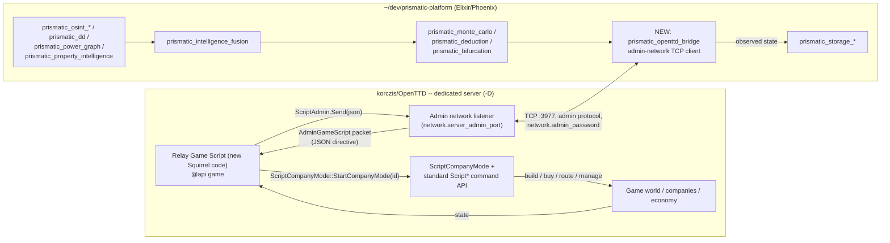
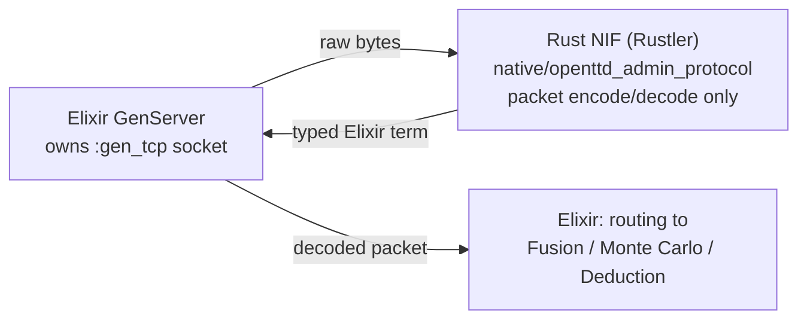
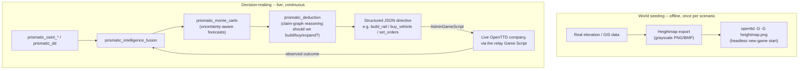

# Prismatic ↔ OpenTTD bridge — architecture design

**Status: design only. No bridge code exists yet, on either side. Nothing in `~/dev/prismatic-platform` has been touched.**

This document exists to get a concrete, technically-grounded design approved *before* writing any code, per this fork's own "ask before large changes" rule (`AGENTS.md`). It classifies as an **experimental infrastructure change** under the four kinds of change in `AGENTS.md`/`README.md` §0.1 — it's part of this fork's own validation scaffolding, not a product change to OpenTTD itself.

## 1. What's being asked for

In the owner's own words: use Prismatic to control the in-game player/company, model the game world from real-world data, connect real OSINT/due-diligence/modeling data, reuse OpenTTD's existing UI as-is, and build a genuine two-sided backend bridge into `~/dev/prismatic-platform` that makes use of as much of Prismatic's existing capability (§0.2.5 of the README: OSINT, due diligence, Monte Carlo, deduction, power-grid/property modeling, intelligence fusion) as makes sense.

Restated as four separate technical goals, since they don't all use the same mechanism:

1. **Control** — let an external process decide what a company does (build track, buy vehicles, set routes, manage the economy).
2. **Observation** — let the external process see what's actually happening in the game (state, economy, results of its own decisions).
3. **World seeding from real data** — generate or influence the map from real-world geographic/infrastructure data instead of OpenTTD's procedural generator.
4. **UI reuse** — the player-facing game client stays exactly what it is; nothing about rendering or input changes.

## 2. What OpenTTD actually supports (verified against source, not assumed)

Before designing anything, this fork's existing admin-network, scripting, and world-generation code was read directly (see commit history of this file's directory for the research pass). Confirmed facts:

- **The admin network** (`docs/admin_network.md`, `src/network/network_admin.cpp`, `src/network/core/tcp_admin.h`) is a real, documented, packet-based TCP protocol (default port 3977, configured via `network.server_admin_port` / `network.admin_password` in `openttd.cfg`, see `src/table/settings/network_settings.ini` and `network_secrets_settings.ini`). It's the only sanctioned way for an external process to talk to a running game.
- **`PacketAdminType::AdminGameScript`** lets an admin client send an arbitrary JSON string into the currently-running **Game Script** (`ReceiveAdminGameScript` → `Game::NewEvent(new ScriptEventAdminPort(json))`, `network_admin.cpp:530`). The reverse path, `ScriptAdmin::Send` (`src/script/api/script_admin.cpp:119`), lets a Game Script push a JSON table back out to every connected admin as `PacketAdminType::ServerGameScript`. **This bidirectional JSON channel is the actual bridge transport** — it already exists, nothing needs to be invented at the protocol level.
- **`rcon` is not a control channel.** `AdminRemoteConsoleCommand` only reaches `IConsoleCmdExec` (server-console commands: kick/ban/settings/etc.), not `DoCommand` gameplay execution. Do not build company control on rcon.
- **Squirrel scripts (both company AI and Game Scripts) have no socket or file I/O.** `src/script/squirrel_std.cpp` registers only the math stdlib — no io/system/blob libs anywhere in the codebase. A script cannot "phone home" on its own; the admin TCP connection is the only door in or out, and it's Prismatic's side that has to hold that connection open.
- **`ScriptCompanyMode`** (`src/script/api/script_companymode.hpp`, Game-Script-only) lets a Game Script switch into *any* company's context and issue normal commands "as if the real player is executing them," restoring the original context afterward. **This is the actual company-control mechanism** — combined with the standard `Script*` command API (build track, buy/manage vehicles, set orders, etc., the same API real AI opponents use).
- **Observation** is available two ways: (a) admin-network subscriptions/polls for `Date`, `CompanyInfo`, `CompanyEconomy`, `CompanyStats`, `Chat`, `Console` — standard, stable, built in; (b) `CmdLogging`, a live feed of every incoming `DoCommand` — useful for debugging, but its docs explicitly warn the format isn't stable across versions, so nothing should depend on it long-term. Prefer (a), plus whatever state the relay Game Script chooses to push itself via `ScriptAdmin::Send`, which is entirely under this fork's own control.
- **World seeding from real elevation data is confirmed reachable headlessly today**: `-G <heightmap-file>` on the command line loads a grayscale heightmap and starts a new game with no GUI required (`src/openttd.cpp`, `SwitchMode::StartHeightmap` → `MakeNewGame`). The companion **JSON town-data importer** described in `docs/importing_town_data.md` (built for exactly this kind of real GIS/OpenStreetMap-derived data) is documented only as a Scenario Editor GUI workflow — whether it's reachable headlessly/scriptably is **not yet confirmed** and needs its own research spike before Phase 4 below is designed in detail.
- **A dedicated server (`-D`)** already runs a plain tick loop with no GUI dependency, its own stdin console, and can run the admin-network listener at the same time — a legitimate, already-existing host for a bridge-controlled game.

## 3. Architecture

- **Nothing about the OpenTTD game client or UI changes.** A human can still connect and play normally, or just watch; the relay Game Script and admin connection are invisible to the client-side rendering/input path (§0.1's goal 1, "UI reuse," is satisfied by construction — there's no mechanism here that touches `src/video/`, `src/gfx.cpp`, or any widget code).
- **The relay Game Script is new code that must be written**, but it's *content*, not an engine change — it's a `.nut` script loaded like any other Game Script, not a modification to `src/`. It belongs under `research/prismatic-bridge/` in this fork (experimental infrastructure, per `AGENTS.md`'s four kinds of change), not under `src/game/`.
- **`prismatic_openttd_bridge` is new code that must be written on the Prismatic side** — nothing in the current ~90 applications speaks OpenTTD's admin-network wire protocol. This is the one piece of the whole design that requires touching `~/dev/prismatic-platform`, which is why it's called out explicitly rather than assumed.

### 3.1) Implementation choice for `prismatic_openttd_bridge`: Rust NIFs via Rustler

The admin-network protocol is packet-based binary TCP (length-prefixed packets, fixed-width integer/string fields, its own auth handshake) — exactly the kind of thing worth implementing in Rust rather than hand-rolled Elixir binary pattern-matching. Checked directly rather than assumed: **this is not a new dependency for Prismatic** — `apps/prismatic_audio/native/` and `apps/prismatic_quantum_security/native/` are existing Rustler-based NIF crates in that codebase already (and `prismatic_web`'s `mix.exs` already depends on `rustler`), so `prismatic_openttd_bridge` would follow an established, already-working convention rather than introduce a new toolchain.

Proposed split of responsibility, chosen specifically to avoid a real NIF pitfall:

- **Rust NIF (`native/openttd_admin_protocol/`)**: pure packet **encode/decode only** — turn a raw byte buffer into a typed Elixir term (packet type + fields) and back. Pure, fast, deterministic, safe to run as a regular (non-dirty) NIF because it never blocks.
- **Elixir owns the TCP socket** (`:gen_tcp` / a `GenServer` or `:ranch`-style connection process) and calls into the Rust NIF once per packet for encode/decode. This deliberately avoids the classic Rustler mistake of doing blocking socket I/O *inside* a NIF, which stalls a BEAM scheduler thread — that would need a "dirty" NIF or a Rust-side OS thread bridged back via `rustler::Env`/a resource type, meaningfully more complex for no benefit here, since packet parsing itself is fast enough to be a normal NIF and the socket already belongs on the Elixir/OTP side where supervision, backpressure, and reconnect logic are cheap to get right.

This keeps the same phase boundaries as §5 below — Phase 1 becomes "scaffold `native/openttd_admin_protocol` (Rust, encode/decode of the handful of packet types needed for the round trip) + a thin Elixir `GenServer` socket owner," not a rewrite of the plan.

## 4. Data flow for "modelování světa" / "napojit reálná data"

Two distinct data flows, on different timescales — conflating them was the main risk in the original one-sentence framing, so they're split out explicitly:

- **World seeding** happens once (or rarely) per scenario, offline, before the server even starts — it's a data-preparation step, not a running integration.
- **Decision-making** is the actual live bridge — continuous, small JSON messages, low frequency relative to OpenTTD's own tick rate (game-economy decisions happen on the order of seconds-to-minutes of game time, not every tick).
- The two are independent: Phase 4 (world seeding) can be built or skipped without affecting Phases 1–3 (control/observation), and vice versa.

## 5. Phased plan

Each phase should be re-approved before starting the next one — this table is a proposal, not a commitment to build all five.

| Phase | Goal | Touches `prismatic-platform`? | Validated by |
|---|---|---|---|
| 0 | This document | No (read-only research) | Human review of this doc |
| 1 | Wire-protocol round trip: a trivial relay GS that echoes `AdminGameScript` JSON back via `ScriptAdmin.Send`; `native/openttd_admin_protocol` Rust NIF (Rustler) for packet encode/decode + a thin Elixir `GenServer` socket owner that connects, authenticates, sends one message, receives the echo | **Yes** — `prismatic_openttd_bridge` scaffold (Elixir app + Rust NIF crate, following the `prismatic_audio`/`prismatic_quantum_security` convention) | `tools/gate.sh` (OpenTTD side, once the relay GS has any automated check) + Prismatic's own `just check` (which already covers Rust-backed apps) |
| 2 | Real company control: JSON schema for `build_rail`/`buy_vehicle`/`set_orders`/etc.; relay GS uses `ScriptCompanyMode` + `Script*` API to execute them | Yes | Both sides' gates, plus a manual in-game check (does the track actually get built) |
| 3 | Observation loop: periodic `CompanyEconomy`/`CompanyStats` push from the relay into `prismatic_storage_*`, closing the loop so decisions can be evaluated against outcomes | Yes | Both sides' gates |
| 4 | World seeding from real elevation/GIS data via `-G`; town-data JSON path researched and either used headlessly or explicitly deferred | Yes (data-prep pipeline) | `tools/gate.sh` + a manual headless-start check |
| 5 | Live decision-making wired to `prismatic_monte_carlo`/`prismatic_deduction`/`prismatic_dd`/`prismatic_intelligence_fusion` instead of a hardcoded test script — this is where "využití maxima features" actually lands | Yes | Both sides' gates + a `research/experiment-template.md` report per experiment run |

## 6. Explicitly out of scope for now

- Any change to OpenTTD's `src/` — the entire design routes through the existing admin-network + Game Script API precisely so `src/` never needs to change.
- Any change to OpenTTD's UI/rendering/input path — confirmed unnecessary (§3).
- Relying on `rcon` or `CmdLogging` as load-bearing mechanisms — confirmed wrong/unstable (§2).
- Headless town-data JSON import — unconfirmed, deferred to its own research spike before Phase 4 commits to it.
- Building any of Phases 1–5 in this session — this document is Phase 0 only, per the explicit instruction that started it.

## 7. Open questions / risks

- **Wire protocol implementation cost on the Prismatic side.** The admin-network protocol (packet-based binary TCP, its own auth handshake) has to be implemented from scratch — no existing client library was found in either repository, in Rust or Elixir. Lower risk than it would otherwise be, since `prismatic_audio`/`prismatic_quantum_security` already prove the Rustler/native-crate pattern works in this codebase, but the protocol implementation itself (packet types, auth handshake, framing) is still new work. Still the single biggest effort unknown in the whole plan.
- **NIF/scheduler discipline.** §3.1's split (Rust NIF = pure encode/decode only, Elixir owns the socket) is a deliberate choice to avoid blocking a BEAM scheduler thread inside a NIF — it should be treated as a hard constraint during Phase 1 implementation, not just a suggestion, since relaxing it later (e.g. "just do the socket read in Rust too, it's simpler") is exactly the kind of shortcut that causes hard-to-diagnose BEAM scheduler starvation under load.
- **Command latency / game-tick alignment.** `ScriptCompanyMode`-issued commands still go through the normal two-phase (test + execute) command pipeline and, in a networked game, the deterministic-lockstep command queue — a directive sent by Prismatic won't execute instantly, and the relay GS needs a defined way to report success/failure back (mirroring this fork's own PASS/FAIL/PARTIAL/NOT RUN taxonomy from `research/README.md` would be a natural fit for per-directive reporting).
- **Versioning.** Both `docs/admin_network.md` and the `CmdLogging` packet explicitly warn that formats can change between OpenTTD versions. A relay built against this fork's current revision may need updating if this fork's OpenTTD base is ever updated.
- **Scope of "maximum features."** §0.2.5 lists ~13 Prismatic applications with real-world data connections; wiring all of them in is a large surface. Phase 5 should probably pick one concrete decision domain first (e.g., "should this company build a rail line here, informed by `prismatic_power_graph` infrastructure data") rather than attempting breadth immediately.
