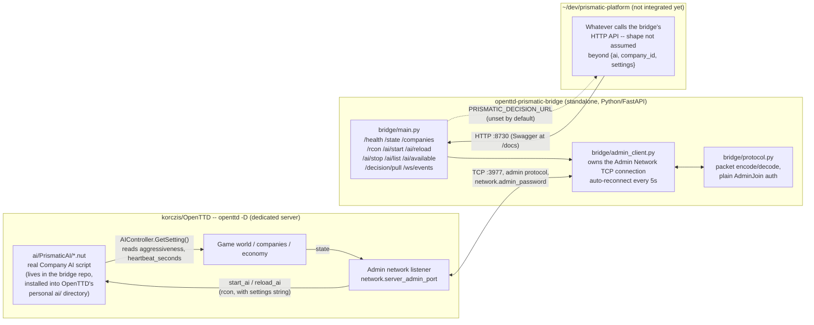
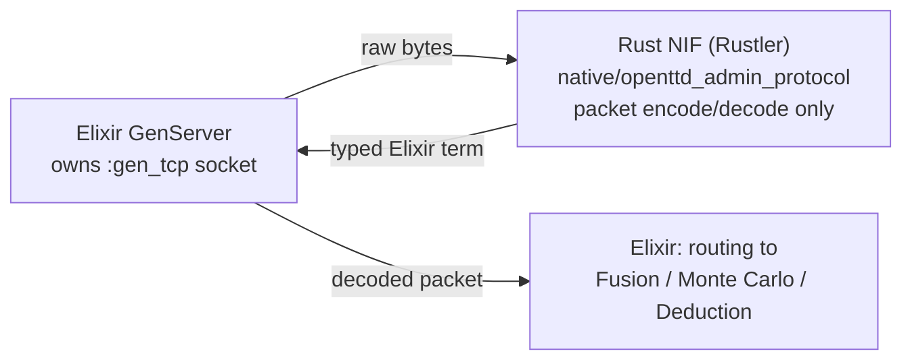

# Prismatic ↔ OpenTTD bridge — architecture design

**Status: Phase 1 (wire-protocol + basic control-path round trip) is real and built — as a standalone third repository, `~/dev/openttd-prismatic-bridge` (Python/FastAPI), not inside `~/dev/prismatic-platform`.** This document was originally written before that repository existed and proposed a different mechanism (a Game-Script JSON relay, an Elixir/Rust-NIF client living inside `prismatic-platform`); it's since been corrected to describe what was actually built, which superseded that proposal — see §3 and §7 for exactly how and why. `~/dev/prismatic-platform` itself has still not been touched by any of this.

This document exists to keep a concrete, technically-grounded design approved and up to date, per this fork's own "ask before large changes" rule (`AGENTS.md`). It classifies as an **experimental infrastructure change** under the four kinds of change in `AGENTS.md`/`README.md` §0.1 — it's part of this fork's own validation scaffolding, not a product change to OpenTTD itself.

## 1. What's being asked for

In the owner's own words: use Prismatic to control the in-game player/company, model the game world from real-world data, connect real OSINT/due-diligence/modeling data, reuse OpenTTD's existing UI as-is, and build a genuine backend bridge that makes use of as much of Prismatic's existing capability (§0.2.5 of the README: OSINT, due diligence, Monte Carlo, deduction, power-grid/property modeling, intelligence fusion) as makes sense.

Restated as four separate technical goals, since they don't all use the same mechanism:

1. **Control** — let an external process decide what a company does (build track, buy vehicles, set routes, manage the economy).
2. **Observation** — let the external process see what's actually happening in the game (state, economy, results of its own decisions).
3. **World seeding from real data** — generate or influence the map from real-world geographic/infrastructure data instead of OpenTTD's procedural generator.
4. **UI reuse** — the player-facing game client stays exactly what it is; nothing about rendering or input changes.

## 2. What OpenTTD actually supports (verified against source, not assumed)

Before designing anything, this fork's existing admin-network, scripting, and world-generation code was read directly. Confirmed facts:

- **The admin network** (`docs/admin_network.md`, `src/network/network_admin.cpp`, `src/network/core/tcp_admin.h`) is a real, documented, packet-based TCP protocol (default port 3977, configured via `network.server_admin_port` / `network.admin_password` in `openttd.cfg`, see `src/table/settings/network_settings.ini` and `network_secrets_settings.ini`). It's the only sanctioned way for an external process to talk to a running game.
- **`rcon` cannot issue arbitrary gameplay `Commands` directly** — `AdminRemoteConsoleCommand` only reaches `IConsoleCmdExec` (server-console commands), not `DoCommand` execution. But — and this is the key insight the actually-built bridge uses — **`IConsoleCmdExec` includes `start_ai [<AI>] [<settings>]` and `reload_ai <company-id>`**, which (re)start a company's AI script with a caller-supplied settings string. That's a real, if coarse-grained, external control path that doesn't need any new OpenTTD-side code at all: a settings string reachable over rcon, read by a normal AI script through the standard `AIController.GetSetting()` API. **This is the mechanism actually implemented — see §3.**
- **`PacketAdminType::AdminGameScript`** also exists and would work: it lets an admin client send an arbitrary JSON string into a running **Game Script** (`ReceiveAdminGameScript` → `Game::NewEvent(new ScriptEventAdminPort(json))`, `network_admin.cpp:530`), with `ScriptAdmin::Send` (`src/script/api/script_admin.cpp:119`) as the reverse path. Combined with `ScriptCompanyMode` (`src/script/api/script_companymode.hpp`, Game-Script-only — lets a Game Script act inside any company's context "as if the real player is executing it"), this would give live, fine-grained, low-latency bidirectional control. **This was the original proposal in this document and remains a valid future upgrade path (§7) for finer-grained control than restarting an AI script gives you — it was not what got built first, because `start_ai`/`reload_ai` needed zero new OpenTTD-side script code to prove the control path end-to-end.**
- **Squirrel scripts (both company AI and Game Scripts) have no socket or file I/O.** `src/script/squirrel_std.cpp` registers only the math stdlib — no io/system/blob libs anywhere in the codebase. A script cannot "phone home" on its own; the admin TCP connection is the only door in or out, and something outside the game process has to hold that connection open. This is true regardless of which control mechanism is used, and is why a bridge process is unavoidable no matter what.
- **Observation** is available two ways: (a) admin-network subscriptions/polls for `Date`, `CompanyInfo`, `CompanyEconomy`, `CompanyStats`, `Chat`, `Console` — standard, stable, built in, and what's actually implemented today (§3); (b) `CmdLogging`, a live feed of every incoming `DoCommand` — useful for debugging, but its docs explicitly warn the format isn't stable across versions, so nothing should depend on it long-term.
- **World seeding from real elevation data is confirmed reachable headlessly today**: `-G <heightmap-file>` on the command line loads a grayscale heightmap and starts a new game with no GUI required (`src/openttd.cpp`, `SwitchMode::StartHeightmap` → `MakeNewGame`). The companion **JSON town-data importer** described in `docs/importing_town_data.md` (built for exactly this kind of real GIS/OpenStreetMap-derived data) is documented only as a Scenario Editor GUI workflow — whether it's reachable headlessly/scriptably is **not yet confirmed** and needs its own research spike before Phase 4 below is designed in detail. Not started.
- **A dedicated server (`-D`)** already runs a plain tick loop with no GUI dependency, its own stdin console, and can run the admin-network listener at the same time — confirmed as the actual host in `~/dev/openttd-prismatic-bridge`'s own run instructions (redirecting stdin from `/dev/null`, since an inherited/closed stdin makes `-D` treat EOF as a shutdown request).

## 3. Architecture — as actually built

The realized architecture is **three independent repositories/services**, not two:

```
korczis/OpenTTD                openttd-prismatic-bridge         prismatic-platform
(this repo)                    (standalone, GitLab)              (untouched so far)
+------------------+           +------------------------+       +---------------------+
| openttd -D        |          | Python 3 / FastAPI      |       | ~90 Elixir/Phoenix   |
| dedicated server   | <--TCP-- |  bridge/admin_client.py |       | apps -- OSINT, DD,   |
|  runs ai/          |  :3977  |  bridge/protocol.py     |       | Monte Carlo,         |
|  PrismaticAI/*.nut  |  admin  |  bridge/main.py (REST + |<-HTTP-|  deduction, power     |
|  (real Company AI,  |  net    |    /ws/events WebSocket)|  ??   |  graph, property      |
|   externally        |         +------------------------+       |  intelligence, ...   |
|   steerable)        |                                          |  (not integrated yet) |
+--------------------+                                          +----------------------+
```



- **`prismatic-platform` doesn't need to speak OpenTTD's binary admin protocol at all.** That was the single biggest assumption this document originally made (an Elixir NIF client living inside the umbrella) and it turned out to be unnecessary — the standalone bridge already speaks it, in Python, and exposes a normal REST/WebSocket API instead. Whatever eventually calls `PRISMATIC_DECISION_URL` / gets polled by `/decision/pull` just needs to speak HTTP and return `{"ai": str, "company_id": int, "settings": str}` — trivial from any Elixir/Phoenix controller, no protocol work needed on that side.
- **`prismatic_openttd_bridge` as an Elixir app inside `prismatic-platform` was never built, and doesn't need to be**, given the above — unless a future decision explicitly wants the admin-network client itself to live inside the Elixir umbrella instead of as a sibling service (see §7).
- **Nothing about the OpenTTD game client or UI changes.** A human can still connect and play normally, or just watch; goal 4 from §1 ("UI reuse") is satisfied by construction — nothing here touches `src/video/`, `src/gfx.cpp`, or any widget code.
- **`ai/PrismaticAI/*.nut` is real code that exists**, but it's *content* (a normal Company AI script, loaded from OpenTTD's personal `ai/` directory like any other), not an engine change — no `src/` modification was needed. It currently proves the control path (settings are readable, a heartbeat is loggable) but "intentionally idles" — no build/buy/route logic is implemented yet (see Phase 2, §5).

### 3.1) Why Python/FastAPI, not Rust+Rustler — and what "Rust" would actually mean now

An earlier instruction in this session asked for the bridge to use Rust + Rustler + NIFs. That request predates knowing `openttd-prismatic-bridge` already existed as a working, tested (8/8 unit tests passing), standalone **Python** service — not an Elixir app, so **Rustler doesn't directly apply**: Rustler specifically binds Rust to the BEAM/Elixir; a standalone Python service would use a different binding (PyO3/`maturin`), or could be rewritten as a native Rust service with no host language at all (e.g. `axum` + `tokio`).

This document doesn't resolve that discrepancy by picking one and silently rewriting working code — that would be a large, unrequested change (see `AGENTS.md`: prefer minimal changes, ask before large ones). The real options, laid out for an explicit decision:

| Option | What it means | Cost |
|---|---|---|
| **Keep Python as-is** | No change. `bridge/protocol.py`'s hand-written struct-style packet encode/decode stays Python. | None — already working, 8/8 tests passing. |
| **Accelerate `bridge/protocol.py` with a Rust extension via PyO3/`maturin`** | Rewrite just the packet encode/decode layer in Rust, expose it to the existing FastAPI app as a Python extension module. Closest analog to the original "Rust NIF" idea, just for Python instead of Elixir. | Moderate — new build toolchain (`maturin`) for this one repo; packet parsing isn't currently a measured bottleneck, so the benefit is unproven. |
| **Rewrite the whole bridge natively in Rust** (e.g. `axum`) | Retire FastAPI/uvicorn entirely. | Large — a full rewrite of a repo that already works and is tested. |
| **Move the admin-network client into `prismatic-platform` as an Elixir app with a Rustler NIF** | The original proposal in this document's first draft — `native/openttd_admin_protocol/` following the `prismatic_audio`/`prismatic_quantum_security` convention (confirmed to already exist in that codebase), Elixir owning the socket, Rust NIF doing pure encode/decode only (to avoid blocking a BEAM scheduler thread — see the original design rationale preserved below). Would mean retiring the standalone bridge repo, or keeping it only for non-Elixir consumers. | Large — duplicates working functionality inside a different repo/language, only justified if `prismatic-platform` itself needs to own the connection rather than call an HTTP API. |

**No option has been chosen.** Given a working, tested implementation already exists, the default going forward is "don't rewrite it without a concrete reason" — but this table exists so the choice is explicit next time it comes up, not re-litigated from scratch.

<details>
<summary>Original Rustler/NIF design rationale (preserved for reference, not currently applied)</summary>

The admin-network protocol is packet-based binary TCP (length-prefixed packets, fixed-width integer/string fields, its own auth handshake). If the client ever does move into `prismatic-platform` as an Elixir app, the proposed split was:

- **Rust NIF (`native/openttd_admin_protocol/`)**: pure packet **encode/decode only** — turn a raw byte buffer into a typed Elixir term (packet type + fields) and back. Pure, fast, deterministic, safe to run as a regular (non-dirty) NIF because it never blocks.
- **Elixir owns the TCP socket** (`:gen_tcp` / a `GenServer`) and calls into the Rust NIF once per packet for encode/decode. This deliberately avoids the classic Rustler mistake of doing blocking socket I/O *inside* a NIF, which stalls a BEAM scheduler thread.



</details>

## 4. Data flow for "modelování světa" / "napojit reálná data"

Two distinct data flows, on different timescales — conflating them was the main risk in the original one-sentence framing, so they're split out explicitly:

```mermaid
flowchart TD
    subgraph Slow["World seeding -- offline, once per scenario -- NOT STARTED"]
        Geo["Real elevation / GIS data"] --> HM["Heightmap export<br/>(grayscale PNG/BMP)"]
        HM --> Start["openttd -D -G heightmap.png<br/>(headless new-game start)"]
    end

    subgraph Fast["Decision-making -- live, continuous -- PARTIALLY BUILT"]
        OSINT["prismatic_osint_* / prismatic_dd<br/>(not integrated yet)"] --> Fusion2["prismatic_intelligence_fusion<br/>(not integrated yet)"]
        Fusion2 --> MC["prismatic_monte_carlo<br/>(not integrated yet)"]
        MC --> Ded["prismatic_deduction<br/>(not integrated yet)"]
        Ded --> Directive["POST /decision/pull result<br/>{ai, company_id, settings}<br/>-- endpoint exists, contract undefined"]
        Directive --> Bridge2["openttd-prismatic-bridge<br/>-- BUILT"]
        Bridge2 -- "start_ai / reload_ai<br/>-- BUILT" --> GameLive["PrismaticAI in OpenTTD<br/>-- builds a real single-town<br/>bus route, verified live"]
        GameLive -- "/state, /companies,<br/>/ws/events -- BUILT" --> Fusion2
    end
```



- **World seeding** happens once (or rarely) per scenario, offline, before the server even starts — it's a data-preparation step, not a running integration. Not started.
- **Decision-making**: the bridge's transport (`/decision/pull`, `/ai/start`, `/ai/reload/{id}`, the observation endpoints) is built and tested; what's missing is (a) an actual strategy in `ai/PrismaticAI/main.nut` that does something with its settings besides log a heartbeat, and (b) anything on the `prismatic-platform` side that computes a settings string worth sending.
- The two are independent: world seeding can be built or skipped without affecting the control/observation loop, and vice versa.

## 5. Phased plan

Each remaining phase should be approved before starting — this table tracks real status, not just a proposal anymore.

| Phase | Goal | Status | Touches `prismatic-platform`? | Validated by |
|---|---|---|---|---|
| 0 | This document | Done (this revision) | No (read-only research) | Human review |
| 1 | Control-path round trip: standalone bridge speaking the Admin Network protocol; `start_ai`/`reload_ai` reachable over HTTP; a real, externally-steerable (if idling) Company AI | **Done** — `~/dev/openttd-prismatic-bridge` (Python/FastAPI, `bridge/`, `ai/PrismaticAI/*.nut`, 8/8 unit tests passing) | No — bridge is standalone | Bridge repo's own `pytest tests/`; manually confirmed end-to-end per its README's `curl` examples |
| 2 | Real company strategy: `ai/PrismaticAI/main.nut` actually builds/buys/routes, driven by its settings string, instead of idling | **Done** — single-town bus route (two stops on the town's own already-connected road network, a depot, 1-3 buses scaled by `aggressiveness`); intercity routes (real road pathfinding across arbitrary terrain) remain a follow-up | No | Bridge repo's `pytest tests/` (unaffected — this is a `.nut` change) + a real in-game check: reloading a company with this script took it from `busses: 0, company_value: 1` to `busses: 3, company_value: 11025, performance: 30` |
| 3 | Decision contract: define what `/decision/pull` actually returns and where `PRISMATIC_DECISION_URL` points; wire something on the `prismatic-platform` side to answer it | Not started | **Yes** — first real touch of `prismatic-platform` | Both sides' gates |
| 4 | World seeding from real elevation/GIS data via `-G`; town-data JSON path researched and either used headlessly or explicitly deferred | Not started | No (data-prep pipeline, could live in either repo) | `tools/gate.sh` + a manual headless-start check |
| 5 | Live decision-making wired to `prismatic_monte_carlo`/`prismatic_deduction`/`prismatic_dd`/`prismatic_intelligence_fusion` instead of a placeholder — this is where "využití maxima features" actually lands | Not started | Yes | Both sides' gates + a `research/experiment-template.md` report per experiment run |

## 6. Explicitly out of scope for now

- Any change to OpenTTD's `src/` — the entire design routes through the existing admin-network + AI-script API precisely so `src/` never needs to change. Still true; nothing built so far touched `src/`.
- Any change to OpenTTD's UI/rendering/input path — confirmed unnecessary (§3).
- Relying on `CmdLogging` as a load-bearing mechanism — confirmed unstable-by-design (§2).
- The secure `AdminJoinSecure` (X25519) auth handshake — the bridge repo currently implements only the plain/insecure `AdminJoin` path, fine for localhost dev, explicitly flagged in its own README as not done for anything beyond that.
- Headless town-data JSON import — unconfirmed, deferred to its own research spike before Phase 4 commits to it.
- Rewriting the working Python bridge in Rust — not decided either way, see §3.1.
- Building Phases 2–5 in this session — that's real feature/integration work in (at least) two repositories and needs its own explicit go-ahead per phase.

## 7. Open questions / risks

- **The Rust/Rustler question (§3.1)** is the most concrete open item carried over from this session specifically — it wasn't resolved, just laid out with real options and costs instead of silently applied to code that already works.
- **`/decision/pull` contract is undefined.** The bridge's own README is explicit that "nothing here assumes its shape beyond `{"ai": str, "company_id": int, "settings": str}`" — Phase 3 needs an actual decision here before `prismatic-platform` can be wired in at all.
- **Command latency / game-tick alignment**, for a future upgrade to the finer-grained `ScriptCompanyMode`/Game-Script channel (§2): those commands still go through the normal two-phase (test + execute) pipeline and, in a networked game, the deterministic-lockstep queue — a directive wouldn't execute instantly, and whatever issues it needs a defined way to report success/failure back. Mirroring this fork's own PASS/FAIL/PARTIAL/NOT RUN taxonomy from `research/README.md` would be a natural fit, and would apply equally well to reporting on `start_ai`/`reload_ai` calls today.
- **Versioning.** `docs/admin_network.md` explicitly warns formats can change between OpenTTD versions; `bridge/protocol.py` is written against this fork's current revision and would need updating if this fork's OpenTTD base is ever updated.
- **Coarse-grained control.** `start_ai`/`reload_ai` can restart an AI with new settings, but there's no way to send it a *mid-run* directive without restarting it (losing in-progress state) — worth keeping in mind once Phase 2's real strategy exists; this is exactly the gap the `AdminGameScript`/`ScriptCompanyMode` channel from §2 would close if finer-grained live control ever becomes necessary.
- **Scope of "maximum features."** §0.2.5 lists ~13 Prismatic applications with real-world data connections; wiring all of them in is a large surface. Phase 5 should probably pick one concrete decision domain first (e.g., "should this company build a rail line here, informed by `prismatic_power_graph` infrastructure data") rather than attempting breadth immediately.

## 8. See also

- `~/dev/openttd-prismatic-bridge` — the actual bridge implementation and its own README (run instructions, endpoint list, what's a real follow-up).
- [`README.md`](../../README.md) §0.2.5 of this repository — the Prismatic applications this bridge is ultimately meant to connect to.
